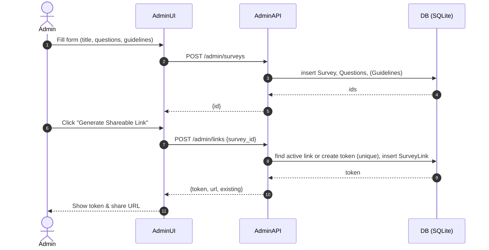
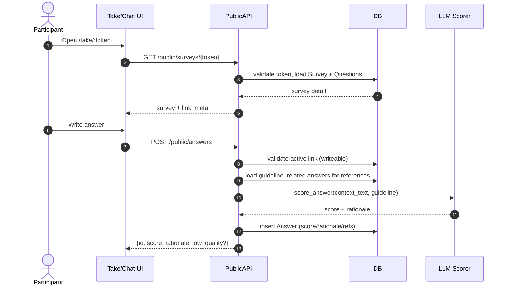

# Survey Bot – API System Design Spec

## 1) Component / Context Diagram
```mermaid
flowchart LR
    subgraph Client["Client (Browser)"]
      A1[Admin UI (/admin)]
      A2[TakeSurvey UI (/take/:token)]
      A3[ChatSurvey UI (/take/:token/chat)]
    end

    subgraph Backend["Backend (FastAPI)"]
      subgraph AdminAPI["Admin API (auth via Admin Key)"]
        AP1["POST /admin/surveys"]
        AP2["GET /admin/surveys"]
        AP3["DELETE /admin/surveys/{id}"]
        AP4["POST /admin/surveys/{id}/questions"]
        AP5["GET /admin/surveys/{id}/detail"]
        AP6["PUT /admin/questions/{qid}/guideline"]
        AP7["DELETE /admin/questions/{qid}/guideline"]
        AP8["DELETE /admin/questions/{qid}"]
        AP9["POST /admin/links"]
        AP10["POST /admin/links/{token}/revoke"]
        AP11["GET /admin/surveys/{id}/responses"]
        AP12["GET /admin/surveys/{id}/export.csv"]
      end

      subgraph PublicAPI["Public API (token-scoped)"]
        PP1["GET /public/surveys/{token}"]
        PP2["POST /public/respondents"]
        PP3["GET /public/respondents/{rid}/answers"]
        PP4["POST /public/answers"]
        PP5["PUT /public/answers/{aid}"]
        PP6["DELETE /public/answers/{aid}"]
        PP7["POST /public/submit"]
      end
    end

    subgraph Data["Data Layer (SQLAlchemy + SQLite)"]
      D1[(Survey)]
      D2[(Question)]
      D3[(Guideline)]
      D4[(SurveyLink)]
      D5[(Respondent)]
      D6[(Answer)]
    end

    A1 -->|Admin Key| AdminAPI
    A2 -->|Link Token| PublicAPI
    A3 -->|Link Token| PublicAPI

    AdminAPI --> Data
    PublicAPI --> Data
```

---

## 2) Domain Model (Entities & Relationships)
```mermaid
erDiagram
  Survey ||--o{ Question : "1..*"
  Survey ||--o| Guideline : "0..1 (survey-level optional)"
  Survey ||--o{ SurveyLink : "0..* (active=1 → write; inactive=0 → read-only)"
  Question ||--o| Guideline : "0..1 (per-question)"
  SurveyLink ||--o{ Respondent : "1..* sessions per link"
  Respondent ||--o{ Answer : "0..* answers per respondent"
  Question ||--o{ Answer : "0..* answers per question"

  Survey {
    int id PK
    string title
    string description
    datetime created_at
  }
  Question {
    int id PK
    int survey_id FK
    int order_index
    string text
    string type
  }
  Guideline {
    int id PK
    int survey_id FK nullable
    int question_id FK nullable
    string content
  }
  SurveyLink {
    int id PK
    int survey_id FK
    string token UNIQUE
    bool is_active
    datetime created_at
  }
  Respondent {
    int id PK
    int link_id FK
    string display_name
    string status ("in_progress"|"submitted")
  }
  Answer {
    int id PK
    int respondent_id FK
    int question_id FK
    string answer_text
    bool flagged
    float score
    string rationale
    bool low_quality
    string referenced_question_ids JSON
    datetime updated_at
  }
```
---

## 3) Endpoint Grouping (by use case)
```mermaid
mindmap
  root((API Surface))
    Admin
      Surveys
        "POST /admin/surveys (create)"
        "GET /admin/surveys (list)"
        "GET /admin/surveys/{id}/detail"
        "DELETE /admin/surveys/{id}"
      Questions & Guidelines
        "POST /admin/surveys/{id}/questions (add)"
        "PUT /admin/questions/{qid}/guideline (upsert)"
        "DELETE /admin/questions/{qid}/guideline"
        "DELETE /admin/questions/{qid}"
      Links
        "POST /admin/links (create or reuse active)"
        "POST /admin/links/{token}/revoke (deprecate)"
      Responses/Export
        "GET /admin/surveys/{id}/responses"
        "GET /admin/surveys/{id}/export.csv"
    Public
      "GET /public/surveys/{token} (load survey)"
      "POST /public/respondents (start session)"
      Answers
        "GET /public/respondents/{rid}/answers"
        "POST /public/answers (create + score)"
        "PUT /public/answers/{aid} (update + rescore)"
        "DELETE /public/answers/{aid}"
      Submit
        "POST /public/submit"
```
---

## 4) Key Flows (Sequence Diagrams)

### 4.1 Admin creates survey → generate link → share


### 4.2 Respondent answers with live scoring


